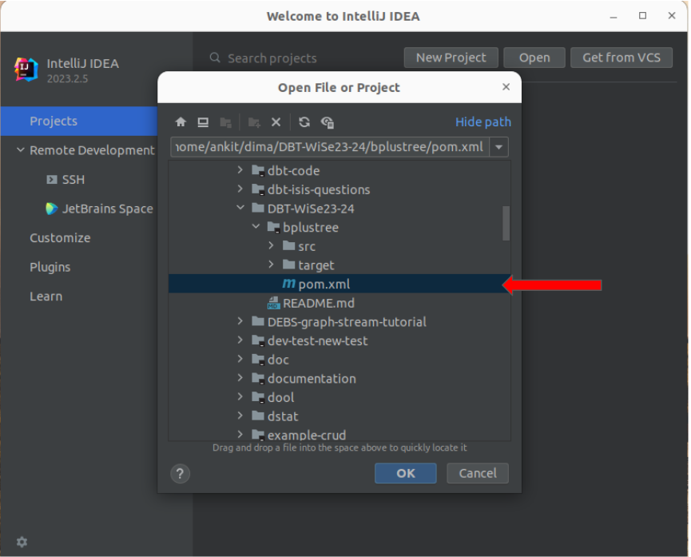
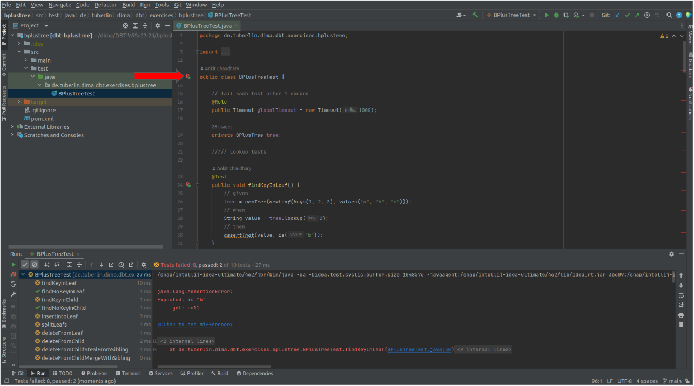
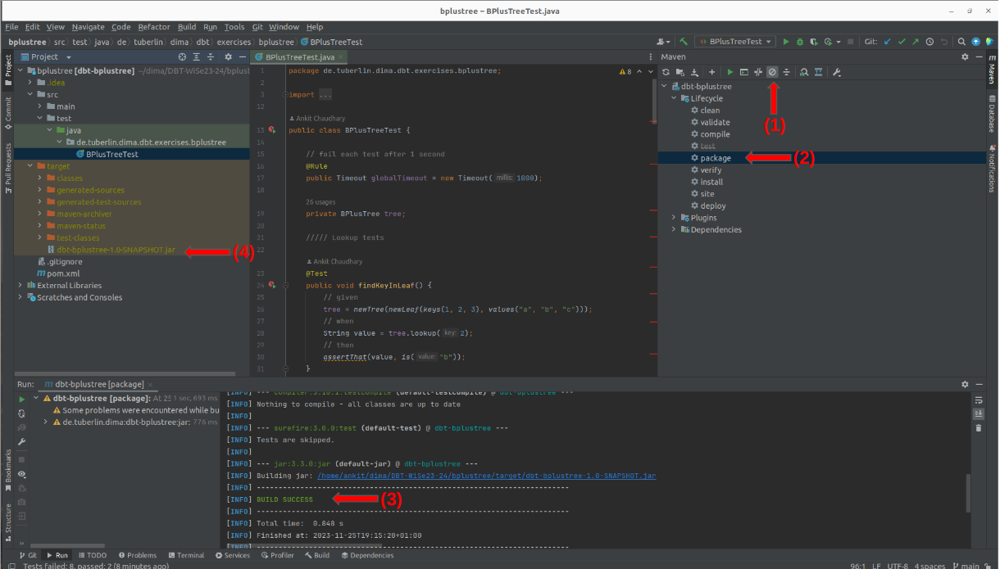
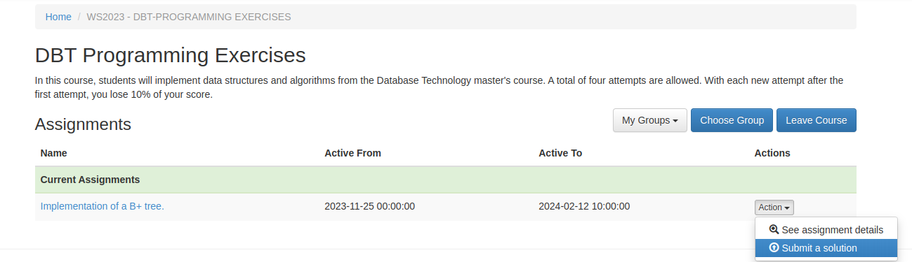
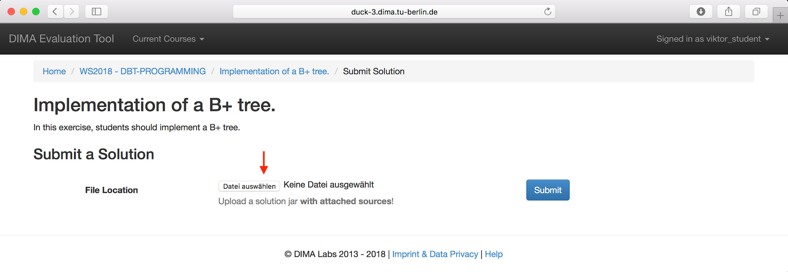
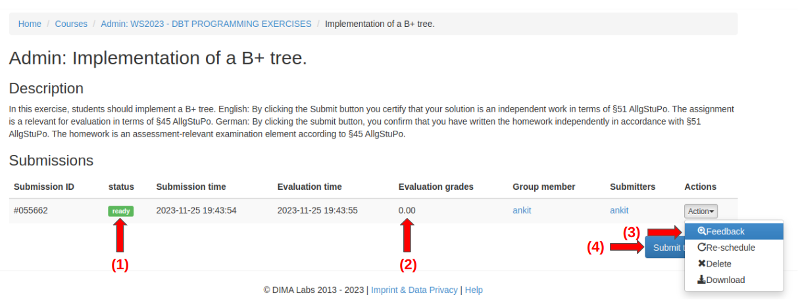
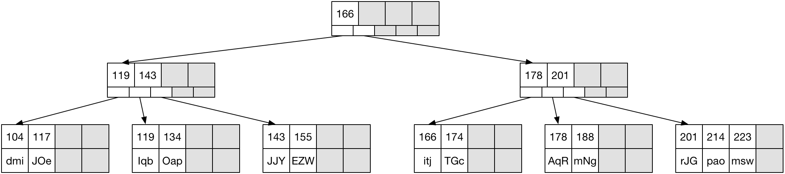

# DBT Programming Exercise: B+ Tree

The task in this programming exercise is to implement a B+ tree. This document describes the grading scheme, code template, gives some hints on the implementation and how to use test cases to drive the implementation. In addition, we explain how to work with JUnit and how to submit code to the evaluation server.


## Grading

With this exercise you can receive up to 20 points, depending on how well you fulfill our test cases.
We expect you successfully complete this task wihtin 10 attempts.

You can get full points only for your first two submissions. 
From the third submission on, your received points will be multiplied with a penalty factor taht limits the mayimal amount of points you can receive.
Points are deducted according to the following scheme:

| Attempt | Penalty factor | Max points possible |
|---:|---:|---:|
| 1–2 | 1 | 20 |
| 3 | 0.95 | 19 |
| 4 | 0.9 | 18 |
| 5 | 0.8 | 16 |
| 6 | 0.7 | 14 |
| 7–10 | 0.6 | 12 |

## Allowed Aids

This task is to be solved **alone** and not in groups. Besides aids that use LLMs (like ChatGPT, Google Bard, Rabbit R1), you can use any aid you want. The use of Large Language Models (LLMs) is explicitly forbidden according to DIMA group policy.

If you have any questions regarding the theoretical exercise, please use the Discussion Forum. However, be aware that it is forbidden to post any Solutions of your tasks in the forum.


## Code template

The implementation consists of four classes: `BPlusTree`, `Node`, `InnerNode`, and `LeafNode`. Details of the classes are given below. The code template requires ***Java 11***.

## `Node` class
This abstract class is the base class for inner nodes and leaf nodes. It stores an array of Integer keys and has abstract accessor methods for the node’s payload. The payload can be the values stored in the B+ tree (leaf nodes) or other nodes (inner nodes).

```java
public abstract class Node {
    protected Integer[] keys;
    public Node(Integer[] keys, int capacity) { … }
    public Integer[] getKeys() { … }
    public void setKeys(Integer[] keys) { … }
    public abstract Object[] getPayload();
    public abstract void setPayload(Object[] payload);
}
```
Note that the class enforces that `keys.length == capacity`.

## `InnerNode` class
This class implements the inner nodes of the B+ tree. It extends the Node class and stores
an array of children, i.e., references to other nodes.

```java
public class InnerNode extends Node {
    private Node[] children;
    public InnerNode(Integer[] keys, Node[] children, int capacity) { … }
    public Node[] getChildren() { … }
    public void setChildren(Node[] children) { … }
    …
}
```

Note that the class enforces that `children.length == capacity + 1 == keys.length + 1`.

## `LeafNode` class
This class implements the leaf nodes of the B+ tree, i.e., the storage of values. It also extends the Node class and stores an array of Strings as values.

```java
public class LeafNode extends Node {
    private String[] values;
    public LeafNode(Integer[] keys, String[] values, int capacity) { … }
    public String[] getValues() { … }
    public void setValues(String[] values) { … }
    …
}
```


Note that the class enforces that values.length == capacity == keys.length.

<div style="color: #8a6d3b; background-color: #fcf8e3; border-color: #faebcc; padding: 10px">


**Important:** The class does not have a pointer to the next leaf. We omit this requirement for this exercise.

</div>

## `BPlusTree` class


This class implements the B+ tree. It contains public methods to lookup a values by a key, insert a key/value pair, and delete a value by a key.

```java
public class BPlusTree {
    private int capacity;
    private Node root;
    public BPlusTree(Node root, int capacity) { … }
    public String lookup(Integer key) { … }
    public void insert(int key, String value) { … }
    public String delete(Integer key) { … }
    …
}
```

Note that the class enforces that capacity is an even number. However, it is your responsibility to enforce the B+ tree conditions:

+ The keys in each node are sorted.
+ Each node (except the root) should contain at least capacity/2 keys.
+ For each innerNode, the following conditions must hold:


Given:

+ `Integer[] keys = innerNode.getKeys();`
+ `Node[] children = innerNode.getChildren();`

Then:
+ If `keys[i] == null` then `children[i+1] == null`.
+ All keys in `children[i].getKeys()` are smaller than `keys[i]`.
+ All keys in `children[j].getKeys()` are greater or equal to `keys[i] if j > i`.


## Helper classes

In addition, there are a two helper classes to create a String representation of a B+ tree (`BPlusTreePrinter`) and to create trees, inner and leaf nodes, and key and value arrays (`BPlusTreeUtilities`).

# Implementation hints

<div style="color: #a94442; background-color: #f2dede; border-color: #ebccd1; padding: 10px">

Note:

1. Our implementation is based on the following paper: https://dl.acm.org/doi/pdf/10.1145/356770.356776. Please refer to Section 3 on B+ tree.
2. The provided implementation is more specific than the one given in the book (Database Systems The Complete Book 2nd Edition).
3. There exists multiple different ways in which B+ tree can be computed. All of these approaches can result in different but valid B+ trees.

</div>

Each of the three operations lookup, insertion, and deletion can be broken down into three steps:
1. Traverse the B+ tree to find the leaf that should contain the key.
2. Manipulate the leaf (lookup the value, insert the key/value pair, or delete the key/value pair).
3. Propagate changes up the tree if necessary.

It is useful to track parent nodes while traversing the tree in step one because we might have to propagate changes up the tree. Because the basic pattern is the same for each public operation, the public methods described above are already implemented. In addition, the BPlusTree class contains the following private helper methods that encapsulate these steps.

```java
private LeafNode findLeafNode(Integer key, Node node, Deque<InnerNode> parents) {
    if (node instanceof LeafNode) { return (LeafNode) node; }
    else {
        InnerNode innerNode = (InnerNode) node;
        if (parents != null) { parents.push(innerNode); }
        // TODO: traverse inner nodes to find leaf node
    }
}

private String lookupInLeafNode(Integer key, LeafNode node) {
    // TODO: lookup value in leaf node
}

private void insertIntoLeafNode(Integer key, String value, LeafNode node, Deque<InnerNode> parents) {
    // TODO: insert value into leaf node (and propagate changes up)
}

private String deleteFromLeafNode(Integer key, LeafNode node, Deque<InnerNode> parents) {
    // TODO: delete value from leaf node (and propagate changes up)
}
```

Implementing these methods correctly is sufficient to pass the exercise. Note that it is possible to contain all additional code in the `BPlusTree` class. However, you can also add code to the `Node`, `LeafNode`, and `InnerNode` classes if you wish. **You should not change the existing code.**


## Splitting during insertion

When inserting a new key in completely full leaf or intermediate/root node, the following process is applied:

### Any node
+ We insert the key i into the full node N with capacity n.
+ Note that n is always even, so a full node has an even number of entries.
+ We virtually insert the key $i$ into the full node. The overfull node now has an odd number of keys.
+ We split the overfull node into two nodes:
    + The first n/2 (which is an integer because n is even) is put into the left node.
    + The last n/2 nodes are put into the right node.
+ This leaves the middle key m, which is moved into the parent node.
+ The resulting tree satisfies the B tree condition that every key in the child node is greater than or equal to the corresponding key in the parent node.

### Special handling for leaves
+ The B+ tree condition states that every key has to be contained in a leaf.
+ Therefore, the middle key m is inserted as the first key in the right leaf.

### Stealing and merging during deletion

If a node does not have enough keys after deletion, it should first steal from its left sibling. If that is not possible, it should steal from its right sibling. If both are not possible, it should merge with its right sibling. If that is not possible, it should merge with its left sibling.

<div style="color: #8a6d3b; background-color: #fcf8e3; border-color: #faebcc; padding: 10px">


**Important:** Your solution does not need to support deletion from a B+tree with height of more than 2 (height as defined in lecture). Such trees post deletion can require key rotations.

Note: Siblings are the nodes that share a common parent/intermediate node.

</div>

# First Stealing than Merging:
- We delete the key i from the node N with capacity n.
- If the number of keys in the node is less than n/2 then it is underfilled. Remember, n is even. We use the following process:
    - We first try stealing a sibling’s key:
        - If possible, we try to steal a value from the left sibling; the key in the parent node is replaced by the moved key.
        - Otherwise, we try to steal a value from the right sibling. If the key in the parent node is less than or equal to the moved key, then we replace it with the smallest key in the right sibling.
    - If stealing is not possible, we try to merge the underfilled nodes:
        - If possible, we try to merge with the right sibling. We remove a key from the parent node such that B+ tree properties are maintained.
        - Otherwise, we try to merge with the left sibling. We remove a key from the parent node such that B+ tree properties are maintained.

**Recap**: Siblings are the nodes that share a common parent/intermediate node.

# Test cases

The code template includes a test class (`BPlusTreeTes`) containing unit tests that help with the implementation of the B+ tree. The evaluation server performs many more tests and covers many corner cases. **Therefore, passing all unit tests in the code template does not guarantee that you get all points in the exercise**. It should, however, allow you to write additional tests for corner cases. The unit tests all follow the following template:

```java
@Test
public void deleteFromLeaf() {
    // given
    tree = newTree(newLeaf(keys(1, 2, 3), values("a", "b", "c")));
    // when
    String value = tree.delete(2);
    // then
    assertThat(value, is("b"));
    assertThat(tree, isTree(
    newTree(newLeaf(keys(1, 3), values("a", "c")))));
}
```

First, a new tree is created in the *given* section. The tree has a default capacity of 4. This section uses the helper methods `newTree`, `newLeaf`, `newNode`, `keys`, `values`, and nodes from the class `BPlusTreeUtilities`.

Then, the tree is manipulated in the *when* section. In this case, a key is deleted and the corresponding value (if any) is stored in a variable.

Finally, the resulting tree is compared against a reference tree in the *then* section. The reference tree is constructed in the same way as the original tree in the *given* section. It is then passed to a JUnit matcher using the `isTree` method and verified using a JUnit assertion. Because this test case tests for the deletion, the returned value is also verified. For more information about JUnit and unit testing, please refer to the documentation: https://junit.org/junit4/.

# Working with IntelliJ
We suggest that you use IntelliJ to implement the exercise. However, it is also possible to
use Eclipse or the command line.
The community edition of IntelliJ is sufficient to implement the exercise. It is also possible to
get a student license for the full version. You can download IntelliJ here:
https://www.jetbrains.com/idea/

## Importing the code template as a new project
After downloading and extracting the code template, import it as a new project.


Select the pom.xml file and click open.



Click OK and OpenAsNewProject on the next window.

## Running unit tests
Open the file BPlusTreeTests.java. Click the green double triangle icon next to the class declaration and execute the class as a unit test. The results of the unit tests will be shown at the bottom of the window. Your goal should be to pass all of the tests.




## Creating a solution JAR
Once you are satisfied with your implementation, you can package it as a JAR file which you should then submit to the evaluation server. In the menu, select View → Tool Windows → Maven Projects.

If you wish to submit a solution with failing tests, activate skip tests mode (1). Then execute the package lifecycle command (2). If there are no compilation errors, a success message should be printed (3). The result is a JAR file that can be uploaded to the solution server (4).




## Upload the solution JAR
The course page of the evaluation server is:
https://evaltool.dima.tu-berlin.de/courses/WS2024/DBT-PROGRAMMING%20EXERCISES

On the page, select the “Submit a solution” action after uploading the JAR file that you created in the last step.





Click the submit button to submit the solution. The solution will be graded automatically.

When the solution is graded the status will indicate “ready” (1). The grade will be shown (2). It is possible to get feedback on the solution (3) or submit another solution (4).




<div style="color: #8a6d3b; background-color: #fcf8e3; border-color: #faebcc; padding: 10px">


**You can submit your solution up to 10 times, but each submission from the third one will incur a penalty. (see description above)**

</div>


In some cases, the status will be shown as “scheduled”. This means that the evaluation server is busy evaluating another submission (possibly from another course). In this case, you should refresh the page periodically to get your result.

# Working with feedback

Clicking on the feedback action will show detailed feedback for each failed test describing what the test did, what was expected, and what happened instead. Below is an example of such a test feedback.The feedback consists of three sections that correspond to the given, when, and then sections described in the section Test cases above. The text below “I started
...” corresponds the given section. Then follows “I tried to …” indicating the operation of the when section. Finally, the text “I expected …” indicates the reference tree and the actual result of the then section.

The trees printed in the feedback follow the following conventions.
- Array contents are printed between square brackets with null values omitted. For example, `[119,143,166,178]` is a full Integer array of size four. `[dmi,JOe,,]` is a half-full String array (note the two commas at the end).
- Leaves are printed in one line. For example, `[104,117,,] => [dmi,JOe,,]` indicates a leaf with two keys and values.
- The keys of inner nodes are printed in one line, followed by a representation of each child node that is indented.

```
I started with the tree:
[119,143,166,178] =>
[104,117,,] => [dmi,JOe,,]
[119,134,,] => [Iqb,Oap,,]
[143,155,,] => [JJY,EZW,,]
[166,174,,] => [itj,TGc,,]
[178,188,201,214] => [AqR,mNg,rJG,pao]
I tried to insert the pair: 223 => msw
I expected the resulting tree to be:
[166,,,] =>
[119,143,,] =>
[104,117,,] => [dmi,JOe,,]
[119,134,,] => [Iqb,Oap,,]
[143,155,,] => [JJY,EZW,,]
[178,201,,] =>
[166,174,,] => [itj,TGc,,]
[178,188,,] => [AqR,mNg,,]
[201,214,223,] => [rJG,pao,msw,]
However, the actual tree was:
[119,143,166,178] =>
[104,117,,] => [dmi,JOe,,]
[119,134,,] => [Iqb,Oap,,]
[143,155,,] => [JJY,EZW,,]
[166,174,,] => [itj,TGc,,]
[178,188,201,214] => [AqR,mNg,rJG,pao]
```

The expected tree in the feedback example above corresponds to the following B+ tree.



Note that the actual keys and values change for each test invocation.
The feedback also contains stack traces of any exception thrown during the grading. In the
middle of the feedback, and before any exception stack trace, there is a section summarizing
the solution.
```
Lookup in leaves: FAILED
Lookup in inner nodes: FAILED
Insertion: FAILED
Insertion with splits: FAILED
Deletion: FAILED
Deletion with stealing: FAILED
Deletion with merging: FAILED
Multiple operations with different capacities: FAILED
Group achieved 0 points.
```

Most sub task are worth one point. Insertion and Deletion are worth 2 points each. Note that
the last task (multiple operations) only requires insertions with splits and deletion (without
stealing or merging). It is therefore possible to get 8/10 points if these operations are
implemented.